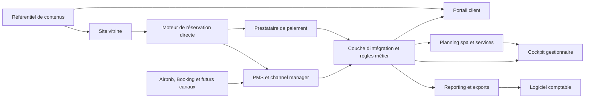

# 08 — Cahier des charges fonctionnel du système d'information v1

Date : 8 août 2026

Projet : Les Nuits au Château — Les Suites de Sainte-Lucie

Statut : cadrage fonctionnel de référence avant choix des solutions et conception
des interfaces.

## 1. Objet

Le système d'information doit permettre de commercialiser deux suites haut de
gamme, d'orchestrer un séjour fortement personnalisé et de piloter l'activité de
la société commerciale d'exploitation.

Il couvre :

- la réservation directe et la distribution sur les plateformes ;
- la synchronisation des disponibilités, prix et dossiers de séjour ;
- la préparation du séjour et l'accueil ;
- les préférences de petit-déjeuner et le dîner au château ;
- la vente et la réservation des équipements du spa ;
- le livret d'accueil et le parcours historique numérique ;
- les communications client ;
- les opérations quotidiennes ;
- les encaissements, rapprochements et indicateurs de gestion.

Le référentiel métier applicable est
`docs/07-referentiel-offre-et-regles-v3.md`.

## 2. Principes directeurs

### 2.1 Acheter le socle hôtelier, personnaliser l'expérience

Le PMS et le channel manager sont des solutions éprouvées du marché. Ils restent
la source de vérité des nuitées, disponibilités, tarifs et canaux. Le projet ne
doit pas recréer artisanalement la synchronisation avec Airbnb ou Booking, la
tokenisation bancaire ou la logique de paiement.

Le développement spécifique porte sur :

- le portail client ;
- le planning des services et équipements ;
- le contenu immersif ;
- les workflows propres au château ;
- le cockpit de gestion et les indicateurs complémentaires.

### 2.2 Une donnée, une source

- Réservations et inventaire : PMS.
- Paiements et préautorisations : prestataire de paiement.
- Services, préférences et créneaux : couche applicative du château.
- Contenus éditoriaux : référentiel de contenu administrable.
- Écritures légales : logiciel comptable de la société d'exploitation.
- Indicateurs : entrepôt ou base de reporting alimentée par les sources ci-dessus.

### 2.3 Expérience sans friction

- Interfaces web responsives, sans application native obligatoire au lancement.
- Portail client accessible par lien personnel sécurisé, sans mot de passe à
  mémoriser.
- Français et anglais sur l'ensemble des parcours client.
- Les choix du client sont visibles et modifiables tant que les règles le
  permettent.
- Toute action payante affiche son prix et ses conditions avant confirmation.

## 3. Périmètre et exclusions

### 3.1 Inclus dans le MVP

- moteur de réservation directe relié au PMS ;
- synchronisation Airbnb et Booking par channel manager ;
- paiement de l'hébergement ;
- portail client bilingue ;
- onboarding et choix de l'accueil ;
- préférences de petit-déjeuner ;
- réservation du dîner ;
- forfait spa et planning des quatre équipements ;
- privatisation de la piscine ;
- garantie bancaire ;
- communications transactionnelles ;
- livret d'accueil numérique ;
- premier parcours historique numérique ;
- cockpit gestionnaire ;
- exports comptables et tableaux de bord essentiels ;
- gestion des tâches de préparation, ménage et maintenance.

### 3.2 Hors MVP

- application native iOS ou Android ;
- programme de fidélité complexe ;
- tarification algorithmique automatisée ;
- reconnaissance faciale ou biométrie ;
- comptabilité générale complète ;
- gestion de restaurant ouverte à une clientèle extérieure ;
- domotique avancée non nécessaire à l'ouverture ;
- place de marché de partenaires locaux ;
- intelligence artificielle répondant seule aux demandes sensibles.

## 4. Acteurs et droits

| Rôle | Droits principaux |
| --- | --- |
| Visiteur | Consulter le site, vérifier une disponibilité, simuler un prix et réserver. |
| Client principal | Gérer le dossier, les occupants, l'accueil, les préférences, les options, les créneaux et le solde. |
| Accompagnant invité | Consulter le séjour et le livret ; proposer des préférences sans modifier les éléments financiers. |
| Hôte / réception | Voir et modifier les séjours, confirmer l'accueil, répondre aux demandes, gérer les options et encaissements. |
| Équipe opérationnelle | Voir les tâches et informations strictement nécessaires au service, sans accès financier complet. |
| Administrateur | Paramétrer l'offre, les utilisateurs, les contenus, les équipements et les intégrations. |
| Comptable / direction | Consulter et exporter les données financières, sans accéder aux informations sensibles non nécessaires. |

Chaque action sensible est journalisée avec auteur, date, ancienne valeur et
nouvelle valeur.

## 5. Architecture fonctionnelle cible

Les échanges prioritaires sont réalisés par API et webhooks. L'iCal ne sert que
de solution de repli lorsqu'un canal ne propose pas de connexion plus fiable.

## 6. Parcours de référence

### 6.1 Réservation directe

1. Le visiteur choisit une suite, des dates et les occupants.
2. Le moteur interroge l'inventaire en temps réel.
3. Le prix détaille nuitées, suppléments et taxe de séjour éventuelle.
4. Les règles essentielles sont affichées : capacité, animaux interdits,
   présence des chiens résidents et conditions d'annulation.
5. Le client renseigne ses coordonnées et accepte les conditions.
6. Le paiement intégral de l'hébergement est authentifié.
7. Le PMS crée la réservation et bloque immédiatement l'inventaire sur tous les
   canaux.
8. La confirmation et le lien personnel du portail sont envoyés.

### 6.2 Réservation provenant d'une plateforme

1. Le channel manager reçoit et enregistre la réservation.
2. Le système vérifie suite, dates, occupants, paiement et canal.
3. Il crée le dossier d'expérience associé sans modifier la réservation source.
4. Le client reçoit, si le canal l'autorise, une invitation vers le portail.
5. Les options sont proposées selon les règles de paiement autorisées par le
   canal.

### 6.3 Préparation du séjour

Le client :

- vérifie les occupants et l'âge des enfants ;
- choisit français ou anglais ;
- indique son heure d'arrivée ;
- choisit accueil humain, autonome ou hybride ;
- renseigne les préférences alimentaires ;
- prend connaissance de la présence des chiens ;
- réserve dîner, spa et privatisation ;
- consulte le livret et les premières séquences historiques ;
- voit les montants payés et restant dus.

Le gestionnaire suit un indicateur de complétude et relance uniquement les
dossiers incomplets.

### 6.4 Arrivée

- Le portail affiche les informations utiles seulement lorsque le dossier est
  confirmé et que le moment de communication prévu est atteint.
- L'accueil humain génère une tâche avec créneau, langue et nom de l'hôte.
- L'arrivée autonome fournit les instructions sécurisées et un moyen de contact.
- Le gestionnaire valide l'arrivée et l'état de la garantie bancaire.
- Le statut du séjour passe à « sur place ».

### 6.5 Pendant le séjour

- Le client consulte son planning et reçoit ses rappels.
- Il peut demander une option encore disponible.
- Il accède au livret, aux règles et au parcours patrimonial.
- Il contacte l'équipe depuis un canal clairement identifié.
- Les gestionnaires enregistrent les prestations consommées, incidents et gestes
  commerciaux.

### 6.6 Départ

1. Le client reçoit un rappel de départ avant 12 h.
2. Les options dues et consommées sont rapprochées.
3. Le solde est présenté et encaissé.
4. La suite est contrôlée et la libération de garantie demandée.
5. La facture détaillée est générée ou transmise selon l'outil retenu.
6. Le séjour passe à « terminé ».
7. Le message de remerciement et la demande d'avis sont programmés.

## 7. Exigences fonctionnelles

### F01 — PMS, inventaire et distribution

- F01.01 : gérer exactement deux unités vendables, Lumière et Feuillage.
- F01.02 : empêcher la vente séparée des pièces composant une suite.
- F01.03 : synchroniser disponibilités, restrictions et réservations avec Airbnb
  et Booking.
- F01.04 : répercuter une réservation directe sur tous les canaux sans délai
  fonctionnel perceptible.
- F01.05 : gérer fermetures, maintenance, séjour minimum et dates non vendables.
- F01.06 : identifier la source, la référence canal, les commissions et le statut
  de paiement.
- F01.07 : détecter et signaler toute incohérence d'inventaire ou réservation en
  doublon.
- F01.08 : conserver une procédure manuelle documentée en cas de panne d'un canal.

### F02 — Prix et moteur de réservation

- F02.01 : calculer 200 € par nuit jusqu'à deux personnes.
- F02.02 : appliquer 25 € par nuit à chaque troisième ou quatrième occupant de
  0 à 5 ans.
- F02.03 : appliquer 50 € par nuit à chaque troisième ou quatrième occupant à
  partir de 6 ans.
- F02.04 : refuser une occupation supérieure à quatre personnes.
- F02.05 : détailler les prestations comprises et les suppléments avant paiement.
- F02.06 : appliquer la politique d'annulation correspondant au canal et au tarif.
- F02.07 : gérer codes promotionnels et avoirs uniquement si activés par un
  administrateur.
- F02.08 : rendre prix, horaires, textes et taxes administrables.

### F03 — Paiement et garantie

- F03.01 : encaisser l'hébergement à la réservation directe.
- F03.02 : prendre en charge l'authentification forte requise par le prestataire.
- F03.03 : stocker uniquement des références tokenisées.
- F03.04 : créer une préautorisation de 500 € ou du montant configuré.
- F03.05 : afficher séparément paiements, préautorisations et sommes dues.
- F03.06 : rembourser totalement ou partiellement selon la règle calculée et une
  validation autorisée.
- F03.07 : permettre l'encaissement des options sur place ou le débit autorisé en
  cas d'impayé ou de non-présentation.
- F03.08 : journaliser toute opération et rapprocher les événements du prestataire.

### F04 — Dossier client et onboarding

- F04.01 : créer un dossier d'expérience pour toute réservation confirmée.
- F04.02 : envoyer un lien personnel à durée de vie contrôlée et révocable.
- F04.03 : permettre au client principal d'inviter ses accompagnants sans exposer
  les données financières sensibles.
- F04.04 : afficher une progression de préparation du séjour.
- F04.05 : enregistrer langue, arrivée, accueil, occupants, préférences et besoins.
- F04.06 : demander une acceptation explicite des règles nécessaires.
- F04.07 : permettre une modification jusqu'aux échéances configurées.
- F04.08 : afficher les coordonnées d'assistance et un mode de secours.

### F05 — Accueil et accès

- F05.01 : proposer les trois modes d'accueil.
- F05.02 : soumettre l'arrivée anticipée à une demande puis à une confirmation.
- F05.03 : générer une tâche d'accueil humain avec langue et créneau.
- F05.04 : ne dévoiler les instructions d'accès qu'au client autorisé et au moment
  prévu.
- F05.05 : permettre la révocation immédiate d'une instruction ou d'un code.
- F05.06 : enregistrer arrivée effective, départ effectif et anomalies.

### F06 — Petit-déjeuner

- F06.01 : proposer une heure entre 8 h et 10 h 30 et une demande anticipée.
- F06.02 : recueillir boissons, préférences, allergies, régimes et besoins enfant.
- F06.03 : permettre au gestionnaire de confirmer ou proposer une alternative.
- F06.04 : produire chaque jour une fiche de préparation agrégée sans données
  superflues.
- F06.05 : distinguer demande client et engagement confirmé par l'établissement.

### F07 — Dîner au château

- F07.01 : accepter une réservation garantie jusqu'à 18 h la veille.
- F07.02 : proposer les quantités adultes, enfants 3–11 ans et moins de 3 ans.
- F07.03 : appliquer 50 €, 25 € ou la gratuité selon la tranche.
- F07.04 : recueillir préférences, allergies et heure souhaitée.
- F07.05 : afficher le menu unique, les boissons comprises et les suppléments.
- F07.06 : marquer le dîner comme dû dès confirmation.
- F07.07 : générer une tâche de préparation et une synthèse de service.
- F07.08 : gérer annulation par l'établissement, remplacement accepté ou geste
  commercial avec traçabilité.
- F07.09 : proposer l'accord mets et vins à 30 € par adulte comme option
  distincte, uniquement lorsque le dîner est réservé.
- F07.10 : limiter l'accord aux adultes et permettre son retrait jusqu'à
  l'échéance opérationnelle configurée.

### F08 — Forfait et planning spa

- F08.01 : vendre un forfait de 50 € par suite et par jour pour un ou deux
  occupants, puis 25 € par troisième ou quatrième occupant et par jour.
- F08.02 : n'autoriser les créneaux que pour une journée couverte par un forfait.
- F08.03 : limiter à deux créneaux par équipement et huit au total par suite et
  par jour.
- F08.04 : empêcher tout chevauchement entre suites pour hammam, sauna et bain.
- F08.05 : autoriser deux réservations simultanées pour la piscine.
- F08.06 : notifier les deux suites lorsque la piscine devient partagée.
- F08.07 : ne jamais afficher l'identité de l'autre suite.
- F08.08 : appliquer une marge technique configurable par équipement.
- F08.09 : permettre le blocage maintenance, météo ou sécurité avec motif.
- F08.10 : proposer une privatisation de deux heures à 50 € supplémentaires.
- F08.11 : vérifier les deux créneaux avant confirmation d'une privatisation.
- F08.12 : consommer les deux droits piscine de la suite qui privatise.
- F08.13 : rendre les créneaux indisponibles à l'autre suite après privatisation.
- F08.14 : marquer un créneau manqué sans rendre le droit réutilisable.
- F08.15 : générer les rappels et tâches de préparation associés.

### F09 — Options et panier de séjour

- F09.01 : présenter les options éligibles selon dates, occupants et canal.
- F09.02 : afficher prix, bénéficiaires, date et conditions avant confirmation.
- F09.03 : conserver le statut financier distinct de l'état opérationnel.
- F09.04 : permettre une demande client puis une confirmation si une intervention
  du gestionnaire est nécessaire.
- F09.05 : calculer en temps réel le total payé, dû et restant à encaisser.
- F09.06 : interdire la suppression silencieuse d'une option confirmée.
- F09.07 : documenter toute annulation ou remise.

### F10 — Livret et parcours immersif

- F10.01 : publier un livret bilingue adapté au mobile et imprimable.
- F10.02 : couvrir arrivée, Wi-Fi, règles, sécurité, services, parc, spa, repas,
  urgence et départ.
- F10.03 : diffuser les contenus historiques sous forme d'étapes courtes.
- F10.04 : relier panneaux physiques et contenus numériques par QR codes durables.
- F10.05 : proposer texte, image, transcription et alternative accessible.
- F10.06 : distinguer faits sourcés, traditions familiales et interprétations.
- F10.07 : permettre une mise à jour sans redéploiement complet de l'application si
  le CMS retenu le permet.
- F10.08 : mesurer les consultations sans identifier inutilement les visiteurs.

### F11 — Communications

- F11.01 : modèles français et anglais pour réservation, paiement, préparation,
  arrivée, services, départ et avis.
- F11.02 : déclenchement par événement métier, pas uniquement par date fixe.
- F11.03 : aperçu et test avant activation d'un modèle.
- F11.04 : journal des messages envoyés, remis et en erreur.
- F11.05 : reprise manuelle d'un envoi échoué.
- F11.06 : préférences séparées entre messages indispensables au séjour et
  communication commerciale.
- F11.07 : aucun code d'accès ou lien sensible dans un canal insuffisamment
  sécurisé si une solution plus sûre est disponible.

### F12 — Cockpit gestionnaire

- F12.01 : vue jour, semaine et mois des deux suites.
- F12.02 : arrivées, départs, séjours en cours et dossiers incomplets.
- F12.03 : planning consolidé des quatre équipements.
- F12.04 : alertes paiement, garantie, conflit, allergie, maintenance et message
  non distribué.
- F12.05 : fiche séjour chronologique regroupant réservation, client, options,
  messages, tâches et finances.
- F12.06 : recherche par client, référence, dates, suite ou canal.
- F12.07 : ajout de notes internes avec niveau de confidentialité.
- F12.08 : actions critiques protégées par confirmation et permissions.

### F13 — Exploitation, ménage et maintenance

- F13.01 : générer des tâches depuis les arrivées, départs et options.
- F13.02 : checklists par suite, espace commun et équipement.
- F13.03 : affecter responsable, échéance, priorité et statut.
- F13.04 : signaler incident, photo éventuelle, impact client et résolution.
- F13.05 : bloquer un équipement ou une suite depuis un incident critique.
- F13.06 : suivre stocks essentiels sans créer un ERP d'achat dans le MVP.
- F13.07 : conserver un historique de maintenance par équipement.

### F14 — Gestion et comptabilité

- F14.01 : calculer nuitées disponibles, vendues et taux d'occupation.
- F14.02 : calculer prix moyen, RevPAR, durée moyenne et délai de réservation.
- F14.03 : suivre chiffre d'affaires hébergement et revenus annexes séparément.
- F14.04 : distinguer facturé, encaissé, remboursé, dû et garanti.
- F14.05 : suivre commissions, revenu net de distribution et part de vente directe.
- F14.06 : analyser spa, dîner, privatisation et suppléments par séjour et période.
- F14.07 : exporter un détail CSV ou format convenu avec l'expert-comptable.
- F14.08 : rapprocher paiements du PMS, du prestataire, des plateformes et de la
  banque sans modifier les écritures légales.
- F14.09 : permettre la saisie ou l'import de charges variables pour une marge de
  gestion, distincte du résultat comptable officiel.
- F14.10 : filtrer les indicateurs par date de séjour et date d'encaissement.

### F15 — Administration

- F15.01 : gérer tarifs, horaires, textes, capacités et délais sans modifier le
  code.
- F15.02 : versionner les conditions commerciales applicables à chaque réservation.
- F15.03 : gérer utilisateurs, rôles et révocation d'accès.
- F15.04 : administrer équipements, périodes d'ouverture et indisponibilités.
- F15.05 : fournir un journal d'audit exportable.
- F15.06 : proposer un mode test qui ne crée ni débit réel ni réservation vendable.

## 8. États métier

### 8.1 Réservation

`brouillon` → `paiement_en_cours` → `confirmée` → `sur_place` → `terminée`

Branches possibles : `paiement_échoué`, `annulée_client`,
`annulée_établissement`, `non_présentation`.

### 8.2 Option

`proposée` → `demandée` → `confirmée_due` → `consommée` → `payée`

Branches possibles : `refusée`, `annulée_établissement`, `non_utilisée_due`,
`offerte`, `remboursée`.

L'état opérationnel et l'état de paiement restent deux dimensions distinctes.

### 8.3 Créneau

`disponible`, `réservé_suite`, `partage_possible`, `partagé`, `privatisé`,
`tampon_technique`, `maintenance`, `fermé`.

## 9. Données principales

| Entité | Données essentielles |
| --- | --- |
| Suite | Identifiant, capacité, statut, contenus, équipements. |
| Réservation | Canal, référence, dates, suite, statut, tarif, paiement, politique applicable. |
| Occupant | Nom si nécessaire, âge ou date de naissance enfant, rôle dans le séjour. |
| Client principal | Coordonnées, langue, consentements, lien au compte de paiement tokenisé. |
| Séjour | Accueil, arrivée, départ, préférences, alertes, complétude. |
| Option | Type, date, quantité, prix, statut opérationnel et financier. |
| Équipement | Capacité, horaires, temps tampon, calendrier, statut. |
| Créneau | Début, fin, suite, partage, privatisation, blocage. |
| Paiement | Référence prestataire, montant, nature, statut, rapprochement. |
| Tâche | Type, échéance, affectation, checklist, statut, incident lié. |
| Contenu | Langue, type, version, source historique, médias, état de publication. |
| Écriture de gestion | Catégorie, séjour, montant, taxe, canal, date d'encaissement. |

Les données sensibles doivent être séparées des contenus éditoriaux et des
données de mesure d'audience.

## 10. Intégrations à prévoir

### Obligatoires

- PMS et channel manager avec connexions Airbnb et Booking ;
- moteur de réservation directe ;
- prestataire de paiement compatible paiement immédiat, remboursement,
  tokenisation, préautorisation et débit différé autorisé ;
- messagerie transactionnelle par e-mail ;
- export vers le système comptable ;
- analytics respectueux du choix de consentement.

### Souhaitables

- SMS ou messagerie mobile pour les informations urgentes ;
- serrures ou codes d'accès temporaires ;
- outil de création de factures si le PMS n'est pas suffisant ;
- diffusion du lien de réservation directe vers les profils et plateformes
  éligibles ;
- stockage documentaire sécurisé pour justificatifs d'incident.

Chaque intégration doit être évaluée sur l'API, les webhooks, la réversibilité,
le support, le coût complet, la sécurité et la capacité à fonctionner avec un
établissement de seulement deux suites.

## 11. Exigences non fonctionnelles

### Disponibilité et continuité

- Le site public et le portail client doivent rester consultables sur mobile.
- Une procédure papier ou export hors ligne couvre arrivées, départs, planning et
  contacts en cas de panne.
- Les sauvegardes sont automatiques, testées et restaurables.
- Les erreurs d'intégration déclenchent une alerte exploitable.

### Performance

- Les pages essentielles doivent rester utilisables sur une connexion mobile
  moyenne.
- Les images sont responsives et optimisées.
- Les actions de réservation affichent un état clair et empêchent les doubles
  validations.

### Accessibilité

- Cible : WCAG 2.2 niveau AA pour les parcours numériques essentiels.
- Navigation clavier, contrastes, textes alternatifs, libellés explicites et
  messages d'erreur compréhensibles.
- Ne pas promettre une accessibilité physique non vérifiée ; publier les
  caractéristiques réelles et un contact pour préparer le séjour.

### Sécurité et confidentialité

- Chiffrement des échanges et authentification forte des gestionnaires.
- Liens client révocables, expirables et limités au séjour concerné.
- Principe du moindre privilège.
- Aucune donnée bancaire complète stockée localement.
- Durées de conservation documentées par catégorie.
- Consentements commerciaux séparés du contrat de séjour.
- Export, rectification et suppression traités selon les obligations applicables.
- Journalisation des accès et actions sensibles.
- Revue de sécurité avant ouverture et après évolution majeure.

### Réversibilité

- Export des réservations, clients, options, contenus, paiements référencés et
  historiques dans des formats ouverts.
- Documentation des mappings et webhooks.
- Le domaine, les comptes prestataires et les données appartiennent à la société
  d'exploitation, pas à un intégrateur individuel.

## 12. Indicateurs de pilotage

### Activité

- taux d'occupation par suite et global ;
- nuitées disponibles et vendues ;
- durée moyenne de séjour ;
- délai moyen de réservation ;
- taux d'annulation et de non-présentation ;
- part de réservations directes.

### Revenus

- chiffre d'affaires hébergement ;
- suppléments d'occupation ;
- spa, privatisation, dîner et boissons ;
- panier moyen par séjour et par client ;
- revenu annexe par nuitée ;
- commissions par canal ;
- revenu net de distribution ;
- prix moyen et RevPAR.

### Expérience et opérations

- complétude de l'onboarding ;
- répartition humain, autonome et hybride ;
- utilisation par équipement ;
- créneaux non utilisés ;
- incidents et temps de résolution ;
- avis, note et verbatims, lorsque la source l'autorise ;
- temps de préparation et respect des checklists.

Le terme « résultat » est réservé au résultat comptable produit ou validé par la
comptabilité. Le cockpit affiche autrement un chiffre d'affaires, une marge de
gestion ou un revenu net de distribution clairement nommé.

## 13. Critères de choix du PMS et des prestataires

Le processus de sélection devra noter chaque solution sur :

1. connexion native Airbnb et Booking ;
2. fiabilité et fréquence de synchronisation ;
3. moteur de réservation personnalisable et bilingue ;
4. compatibilité avec les deux suites vendues intégralement ;
5. règles d'occupation enfant et suppléments ;
6. API et webhooks documentés ;
7. paiements, remboursements et préautorisations ;
8. gestion des taxes, factures et exports ;
9. propriété et export des données ;
10. coût fixe et variable adapté à deux unités ;
11. qualité du support en français ;
12. conformité, sécurité et hébergement des données ;
13. absence d'enfermement contractuel disproportionné ;
14. environnement de test et capacité de migration.

## 14. Recette fonctionnelle minimale

Le MVP n'est accepté qu'après réussite des scénarios suivants :

1. réservation directe de deux adultes, paiement et blocage multicanal ;
2. réservation de quatre personnes avec deux tranches d'âge différentes ;
3. import d'une réservation Airbnb puis invitation au portail ;
4. annulation à chaque palier et calcul du montant remboursé ;
5. choix de chacun des trois modes d'accueil ;
6. arrivée anticipée demandée, refusée puis acceptée sur un autre dossier ;
7. petit-déjeuner avec allergie et confirmation d'une alternative ;
8. dîner adultes et enfants, option due puis encaissée ;
9. achat du spa et réservation des huit droits autorisés ;
10. tentative d'un troisième créneau sur un équipement, correctement refusée ;
11. conflit sur sauna, correctement refusé ;
12. piscine réservée puis partagée avec notification aux deux suites ;
13. privatisation de deux heures, blocage de l'autre suite et consommation des
    deux droits piscine ;
14. blocage maintenance d'un équipement avec traitement des clients concernés ;
15. préautorisation, libération et débit justifié en environnement de test ;
16. départ, encaissement des options, facture et export comptable ;
17. révocation d'un lien client et d'un compte gestionnaire ;
18. fonctionnement du plan de secours sans accès au système principal ;
19. contrôle complet en français et en anglais ;
20. contrôle mobile, clavier, contrastes et messages d'erreur.

## 15. Phasage recommandé

### Phase A — Cadrage et sélection

- validation externe des règles sensibles ;
- matrice de choix PMS, channel manager et paiement ;
- architecture technique ;
- maquettes des parcours ;
- dictionnaire de données et plan de sécurité.

### Phase B — Socle de réservation

- PMS, canaux, moteur direct, paiement et règles tarifaires ;
- intégration au site vitrine ;
- confirmations et premiers exports.

### Phase C — Expérience client

- portail, onboarding, accueil, petit-déjeuner, dîner et spa ;
- communications bilingues ;
- livret et histoire.

### Phase D — Exploitation et gestion

- cockpit, tâches, maintenance, rapprochement et indicateurs ;
- exports comptables ;
- procédures de secours.

### Phase E — Recette et ouverture

- jeux de données de test ;
- tests multicanaux et paiements ;
- simulation de plusieurs séjours complets ;
- formation des gestionnaires ;
- reprise des photographies réelles ;
- bascule contrôlée en production.

## 16. Livrables de la prochaine étape

Avant tout développement spécifique, produire :

- matrice comparative des PMS et channel managers ;
- schéma technique détaillé et contrats d'API ;
- maquettes du moteur, du portail et du cockpit ;
- dictionnaire de données ;
- catalogue des événements et messages ;
- politique de sécurité et conservation ;
- conditions commerciales relues ;
- plan de recette détaillé ;
- estimation du coût initial et récurrent ;
- calendrier de réalisation jusqu'à l'ouverture.
