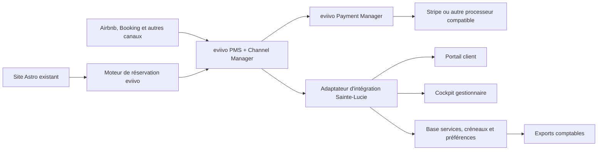

# 09 — Sélection du socle technique v1

Date de l'étude : 8 août 2026

Périmètre : PMS, channel manager, moteur de réservation, paiement et couche
d'intégration pour Les Nuits au Château.

Statut : présélection argumentée à confirmer par démonstration, essai et devis.
Aucun abonnement ne doit être souscrit sur la seule base des pages commerciales.

## 1. Conclusion exécutive

### Recommandation principale : eviivo Suite

eviivo est le meilleur candidat provisoire pour devenir le socle hôtelier du
projet. Il couvre nativement les points les plus difficiles à reconstruire :

- inventaire et synchronisation bidirectionnelle avec Airbnb et Booking ;
- moteur de réservation directe ;
- paiements directs et OTA ;
- suppléments, cautions et préautorisations ;
- rapprochement des cartes virtuelles et commissions OTA ;
- facturation et reporting ;
- API et webhooks couvrant réservations, paiements, ventes additionnelles,
  facturation, comptabilité et serrures ;
- support d'un fonctionnement de chambre d'hôtes et d'un accueil hybride.

La solution annonce un abonnement à partir de 40 € par mois. Payment Manager,
Guest Manager et les autres modules font l'objet d'un devis. L'accès aux API et
à leur documentation est annoncé comme gratuit ; un accompagnement développeur
optionnel peut représenter 750 € de frais uniques.

### Finalistes à conserver

1. **eviivo Suite** — choix recommandé sous réserve du devis et des tests API.
2. **Amenitiz Advanced** — alternative très intégrée et bien accompagnée en
   France, mais prix sur devis et API réservée à l'offre Advanced.
3. **Beds24** — meilleure alternative technique et économique, très ouverte,
   mais avec davantage de paramétrage et une ergonomie moins rassurante pour une
   exploitation familiale.
4. **Smoobu Professional** — alternative simple et économique, mais la caution
   nécessite une solution partenaire et le modèle est davantage orienté location
   saisonnière que maison d'hôtes.

### Solutions non prioritaires

- **Lodgify** : offre complète et plaisante côté client, mais orientation
  location saisonnière, coût exact à clarifier et ouverture API à vérifier selon
  le plan.
- **Little Hotelier** : adapté aux petits établissements, mais informations
  publiques insuffisantes sur les API et présence de frais variables selon les
  réservations.
- **elloha** : intéressant pour la distribution touristique française et locale,
  mais documentation publique insuffisante sur les API et webhooks nécessaires
  au portail personnalisé. À envisager comme canal ou partenaire de distribution,
  pas comme socle retenu sans preuve technique complémentaire.

## 2. Architecture recommandée

### Répartition des responsabilités

| Composant | Responsabilité |
| --- | --- |
| Site Astro | Marque, récit, contenus publics, SEO et entrée vers la réservation. |
| eviivo | Suites vendables, tarifs, disponibilités, réservations et canaux. |
| Payment Manager | Paiements, extras, préautorisations, remboursements et rapprochements. |
| Adaptateur Sainte-Lucie | Traduction des données eviivo vers notre modèle, reprise sur erreur et indépendance du portail. |
| Portail client | Onboarding, accueil, préférences, spa, dîner, livret et histoire. |
| Cockpit | Opérations, planning, options, alertes et indicateurs spécifiques. |
| Logiciel comptable | Écritures comptables légales et clôtures. |

L'adaptateur est indispensable : le portail ne doit jamais appeler directement
le PMS depuis le navigateur. Il vérifie les signatures de webhooks, applique les
droits, masque les secrets, journalise les échanges et limite l'enfermement dans
un fournisseur.

## 3. Critères et pondération

| Critère | Poids | Justification |
| --- | ---: | --- |
| Synchronisation OTA et fiabilité d'inventaire | 20 % | Une seule surréservation aurait un impact disproportionné avec deux suites. |
| API, webhooks et capacité d'intégration | 20 % | Le portail et le cockpit personnalisés en dépendent. |
| Paiement, extras et garantie bancaire | 15 % | L'offre combine paiement immédiat et options payées sur place. |
| Moteur direct et intégration au site | 10 % | Le site existant doit rester la vitrine principale. |
| Fonctions hôtelières et reporting | 10 % | Accueil, factures, rapprochements et exploitation quotidienne. |
| Coût et adéquation à deux unités | 10 % | Éviter un outil dimensionné pour un grand hôtel. |
| Support français et accompagnement | 10 % | Critique lors du lancement et des incidents OTA. |
| Réversibilité, sécurité et propriété des données | 5 % | Réduire la dépendance à long terme. |

## 4. Scoring provisoire

Notes de 1 à 5 établies à partir des fonctionnalités publiées. Le score doit être
révisé après démonstration et réception des devis.

| Solution | OTA 20 | API 20 | Paiement 15 | Moteur 10 | Hôtel 10 | Coût 10 | Support FR 10 | Réversibilité 5 | Total /100 |
| --- | ---: | ---: | ---: | ---: | ---: | ---: | ---: | ---: | ---: |
| eviivo | 5 | 5 | 5 | 4 | 5 | 3 | 5 | 5 | **94** |
| Amenitiz Advanced | 5 | 4 | 5 | 5 | 5 | 2 | 5 | 3 | **88** |
| Beds24 | 5 | 5 | 3 | 4 | 4 | 5 | 2 | 5 | **84** |
| Smoobu Professional | 4 | 5 | 2 | 4 | 3 | 5 | 4 | 4 | **78** |
| Lodgify | 4 | 3 | 4 | 4 | 3 | 3 | 3 | 3 | **69** |
| Little Hotelier | 4 | 1 | 4 | 4 | 4 | 3 | 3 | 2 | **62** |
| elloha | 4 | 1 | 3 | 4 | 3 | 4 | 5 | 2 | **63** |

Une note faible ne signifie pas que la solution est mauvaise. Elle signifie
qu'elle répond moins bien à la combinaison particulière : deux suites, forte
personnalisation, services réservables et besoin d'API.

## 5. Analyse des quatre finalistes

### 5.1 eviivo Suite

#### Forces

- PMS, channel manager et moteur pensés pour hôtels et chambres d'hôtes.
- Connexions API bidirectionnelles avec Booking, Airbnb et de nombreux canaux.
- Synchronisation annoncée des tarifs, disponibilités, contenus, suppléments,
  politiques, taxes, messages et paiements.
- API et webhooks annoncés sur les domaines dont le projet a besoin.
- Payment Manager compatible avec paiements, extras, liens sécurisés, cartes
  virtuelles OTA, préautorisations et rapprochements.
- Choix de plusieurs processeurs, dont Stripe et Worldline.
- Reporting financier et opérationnel déjà structuré.
- Support et documentation en français.

#### Réserves

- Coût réel inconnu avec Payment Manager, Guest Manager et Performance Manager.
- Vérifier que les API donnent effectivement les droits de lecture et d'écriture
  nécessaires au forfait spa et aux options.
- Vérifier si les webhooks sont inclus dans le contrat standard et avec quels
  engagements de service.
- Éviter de remplacer le site Astro par Website Manager : seul le moteur de
  réservation est nécessaire.
- Évaluer les frais du processeur et d'eviivo séparément.

### 5.2 Amenitiz Advanced

#### Forces

- Plateforme hôtelière tout-en-un très présente en France.
- Channel manager, PMS, moteur, check-in, housekeeping, paiements et reporting.
- Préautorisation automatique AmenitizPay configurable par condition de vente.
- API documentée et environnement développeur.
- Accompagnement téléphonique et compte dédié dans l'offre Advanced.

#### Réserves

- API ouverte uniquement dans l'offre Advanced.
- Tarification entièrement sur devis et cible publique plutôt orientée vers les
  établissements de trois chambres et plus.
- Préautorisations dépendantes d'AmenitizPay et non applicables aux cartes
  virtuelles OTA.
- Certaines modifications de plans tarifaires nécessitent l'intervention du
  support.

### 5.3 Beds24

#### Forces

- API V2 et webhooks très documentés.
- Connexions OTA certifiées et moteur direct personnalisable.
- Prix de départ public bas et modèle sans commission.
- Paiement à l'usage, sans contrat long ni frais de mise en place annoncés.
- Forte flexibilité pour les tarifs d'occupation, extras, automatisations et
  exports.
- Bonne réversibilité technique.

#### Réserves

- Configuration plus technique et interface moins adaptée à des gestionnaires
  occasionnels.
- Support principalement par tickets et documentation.
- Valider précisément la préautorisation de garantie et l'expérience de paiement.
- Risque de coût d'intégration supérieur à l'économie d'abonnement.

### 5.4 Smoobu Professional

#### Forces

- Full API Access inclus, API REST documentée et webhooks de réservation.
- Connexion à Airbnb, Booking et de nombreux portails.
- Moteur direct, check-in en ligne, guide invité et automatisations.
- Prix public lisible et essai de 14 jours.
- Prise en main plus simple que Beds24.

#### Réserves

- Pas de gestion native de préautorisation ou dépôt de garantie ; recours à
  Swikly ou ChargeAutomation.
- Paiement et rapprochement moins intégrés que chez eviivo ou Amenitiz.
- Logique davantage orientée locations de vacances.
- Vérifier les droits API précis sur factures, paiements et suppléments.

## 6. Repères tarifaires publics

Les montants suivants sont des repères datés, hors TVA et services additionnels
lorsqu'ils ne sont pas explicitement inclus :

| Solution | Repère public au 8 août 2026 |
| --- | --- |
| eviivo | Abonnement annoncé à partir de 40 €/mois ; modules sur devis ; support développeur dédié optionnel à 750 € en frais uniques. |
| Amenitiz | Prix personnalisé selon établissement ; API dans le plan Advanced. |
| Beds24 | À partir de 15,50 €/mois ; liens channel manager à partir de 0,55 €/mois ; sous-domaine privé 19 €/mois ; onboarding à partir de 79 €. |
| Smoobu | Professional Prepaid affiché à 31,50 €/mois en annuel pour une unité ; unité supplémentaire à partir de 9,60 €/mois ; 0 % de commission sur ce plan. |
| Lodgify | Tarification variable selon plan, nombre d'unités et promotions ; devis ou essai nécessaire. |
| Little Hotelier | Prix non restitué clairement sur la page française ; frais de paiement et frais variables de réservation à demander. |

Le coût complet doit inclure : abonnement, modules, utilisateurs, paiements,
messages, API, onboarding, support, domaine du moteur, facturation, export,
serrures et éventuels frais par réservation.

## 7. Stratégie de paiement recommandée

### Option A — Recommandée

Utiliser eviivo Payment Manager avec Stripe comme processeur, sous réserve que :

- les paiements directs soient rattachés aux réservations ;
- les options créées depuis le portail puissent remonter comme suppléments ;
- une carte réelle puisse garantir les options des réservations OTA dans le
  respect des règles du canal ;
- la préautorisation de 500 € puisse être programmée autour de l'arrivée ;
- les frais eviivo et Stripe soient transparents.

### Option B — Repli

Utiliser le paiement natif du PMS pour l'hébergement et Stripe directement pour
les options du portail. Cette option augmente la complexité de rapprochement et
n'est retenue que si le PMS ne permet pas les écritures nécessaires.

Stripe affiche pour les cartes standard de l'Espace économique européen un tarif
de 1,5 % + 0,25 € par transaction en ligne. Une autorisation en ligne classique
est généralement valable sept jours ; l'empreinte doit donc être créée près de
l'arrivée, pas plusieurs mois lors de la réservation.

## 8. Intégration au site vitrine

- Conserver le site Astro et son identité graphique.
- Ajouter un bouton « Réserver » persistant dans la navigation.
- Ouvrir le moteur dans une page ou un sous-domaine clairement rattaché à la
  marque, plutôt que dans une nouvelle fenêtre générique.
- Transmettre dates, suite et nombre d'occupants lorsque le visiteur part d'une
  page de suite.
- Revenir au site avec une confirmation lisible après réservation.
- Mesurer le passage site → moteur → confirmation sans collecter de données
  inutiles.
- Prévoir une page d'indisponibilité et un contact si le moteur ne répond pas.
- Le domaine, le compte PMS, le compte de paiement et les profils OTA doivent
  appartenir à la société d'exploitation.

## 9. Questions bloquantes à poser en démonstration

### Inventaire et prix

1. Peut-on gérer exactement deux suites indivisibles de quatre occupants ?
2. Le moteur applique-t-il un supplément différent pour un enfant de 0–5 ans et
   une personne de 6 ans ou plus, uniquement au-delà des deux premiers occupants ?
3. Les mêmes règles peuvent-elles être envoyées à Booking et Airbnb, ou quelles
   divergences faut-il maintenir côté OTA ?
4. Quel est le délai contractuel de synchronisation des réservations et
   disponibilités ?

### Paiements

5. Peut-on débiter 100 % de l'hébergement à la réservation puis encaisser les
   extras au départ ?
6. Peut-on programmer une préautorisation fixe de 500 € le jour de l'arrivée ?
7. Comment garantir une option ajoutée à une réservation Airbnb ou Booking ?
8. Comment sont traitées les cartes virtuelles, remboursements partiels,
   rétrofacturations et paiements refusés ?

### API et portail

9. Quels webhooks existent pour création, modification, annulation, paiement et
   check-in/out ?
10. Peut-on lire et écrire les suppléments, factures et statuts de paiement par
    API ?
11. Existe-t-il un environnement sandbox complet ?
12. Quelles limites de débit, politiques de version et garanties de support
    s'appliquent à l'API ?
13. Peut-on joindre un lien personnalisé vers notre portail dans les messages
    envoyés aux clients OTA ?
14. Peut-on récupérer l'adresse e-mail exploitable du client selon chaque canal ?

### Gestion et contrat

15. Quel est le coût TTC complet pour deux suites avec channel manager, moteur,
    paiement, API, deux utilisateurs et reporting ?
16. Quels frais s'appliquent par réservation, transaction, remboursement,
    message et préautorisation ?
17. Comment exporter toutes les données lors d'un départ ?
18. Où les données sont-elles hébergées et quels sous-traitants interviennent ?
19. Quels engagements existent en cas de panne ou de désynchronisation OTA ?
20. Quelle durée d'engagement, procédure de résiliation et assistance de migration ?

## 10. Scénario de démonstration imposé

Chaque fournisseur doit réaliser, devant nous ou dans un environnement d'essai,
le même scénario :

1. créer Lumière et Feuillage comme deux unités ;
2. connecter un canal de test ou montrer le mapping Booking/Airbnb ;
3. réserver Lumière pour deux adultes et deux enfants de 4 et 8 ans ;
4. constater le prix attendu : 250 € + 25 € + 50 € par nuit ;
5. encaisser l'hébergement ;
6. ajouter un forfait spa et un dîner enfant ;
7. laisser les options dues mais payables sur place ;
8. programmer une préautorisation de 500 € ;
9. modifier les dates et observer les mises à jour ;
10. annuler puis appliquer le bon remboursement ;
11. recevoir les webhooks correspondants ;
12. exporter réservation, lignes financières et paiements.

Une solution qui ne peut pas réaliser ce scénario sans contournement lourd ne
doit pas devenir la source de vérité du projet.

## 11. Décision proposée

### Étape 1

Demander une démonstration et un devis complet à eviivo sur la base du scénario
ci-dessus, sans accepter immédiatement le module Website Manager si celui-ci est
facultatif.

### Étape 2

Ouvrir en parallèle les essais Smoobu et Beds24 afin de disposer d'un benchmark
réel de coût, d'API et de simplicité.

### Étape 3

Demander un devis Amenitiz Advanced uniquement si eviivo ne confirme pas l'accès
API, la préautorisation ou l'intégration des extras.

### Go / no-go eviivo

Le choix eviivo devient définitif seulement si les cinq conditions suivantes
sont remplies :

1. devis acceptable pour deux suites ;
2. API et webhooks accessibles dans l'abonnement retenu ;
3. moteur intégrable sans abandonner le site existant ;
4. garantie et extras compatibles avec les réservations directes et OTA ;
5. export complet et résiliation sans enfermement disproportionné.

## 12. Calendrier conseillé

- Août–septembre 2026 : démonstrations, essais, devis et choix.
- Septembre–octobre 2026 : contractualisation et configuration du PMS.
- Octobre–décembre 2026 : moteur direct, paiement et intégration au site.
- Novembre 2026–février 2027 : adaptateur, portail client et cockpit.
- Février–mars 2027 : recette multicanale, paiements et simulations de séjour.
- Mars 2027 : formation, reprise photographique et bascule de production.
- Avril 2027 : ouverture avec surveillance renforcée.

## 13. Sources officielles consultées

- eviivo Property Manager, prix et API :
  https://eviivo.com/fr/produits/property-manager/
- eviivo Channel Manager :
  https://eviivo.com/fr/produits/channel-manager/
- eviivo Payment Manager :
  https://eviivo.com/fr/produits/payment-manager/
- Amenitiz, offres et accès API :
  https://amenitiz.com/en/pricing
- Amenitiz, préautorisations :
  https://support.amenitiz.com/en/articles/332590-how-to-set-up-automatic-pre-authorisations-on-bookings
- Beds24, produit et tarifs :
  https://www.beds24.com/pricing.html
- Beds24, API V2 et webhooks :
  https://wiki.beds24.com/index.php/Category:API_V2
- Smoobu, prix :
  https://www.smoobu.com/en/pricing/
- Smoobu, API et webhooks :
  https://docs.smoobu.com/
- Smoobu, garanties :
  https://support.smoobu.com/hc/en-us/articles/4402152208018-Security-Deposits-and-Pre-Authorization
- Lodgify, offres :
  https://www.lodgify.com/pricing/
- Little Hotelier, offres :
  https://www.littlehotelier.com/pricing/
- elloha, channel manager :
  https://www.elloha.com/channel-manager-sans-commission
- Stripe, tarifs France :
  https://stripe.com/fr/pricing
- Stripe, autorisation et capture :
  https://docs.stripe.com/payments/place-a-hold-on-a-payment-method
